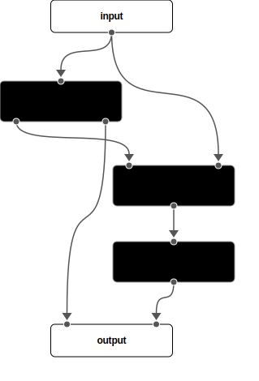
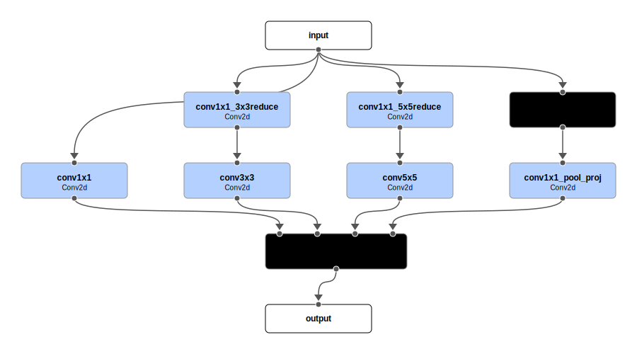

# Examples

I think it can be helpful to house all the examples in a single file, so that it is easy to find them.

## 1. Toy example

This example illustrates the basic usage of the ***CM*** format.

!!! example "Toy example"

    ```yaml 
    name: toy_example
    description: |
      A simple model showcasing the main idea of the YAML format for ComposableModel.
      It consists of two modules, each with a different number of 
      outputs. The first module has two outputs, and the second module has one 
      output. The final output is a combination of the outputs from both modules.
    modules:
      input:
        - x

      module_1:
        cls: module_type_1
        inp_src:
          - x
        config:
          param1: 42
          param2: "42"
        out_num: 2

      module_2:
        cls: module_type_2
        inp_src:
          - module_1.0
          - x
        config: module_2.yaml
  
      module_3:
        cls: module_type_3
        inp_src:
          - module_2

      output:
        - module_1.1
        - module_3
    ```
    
    
    /// caption
    Architecture diagram of the toy example. 
    ///


## 2. Simple conceptual architecture
This example shows how to use the YAML format to create a simple conceptual architecture that is not directly related to a specific model.

!!! example "Simple conceptual architecture"

    ```yaml
    name: simple_conceptual
    modules:
      input:
        - image

      encoder:
        inp_src:
          - image

      middle_layers:
        inp_src:
          - encoder
  
      decoder:
        inp_src:
          - middle_layers

      output:
        - decoder
    ```

    
    /// caption
    Architecture diagram of the simple conceptual architecture.
    ///

## 3. PointNet conv

This example showcase the edge labels when the input sources can be complex.

!!! example "PointNet conv"

    ```yaml
    name: point_net_conv
    description: |
      A simple model consisting of two PointNetConv layers followed by a ReLU 
      activation and a global max pooling layer.
    modules:
      input:
        - pos
        - edge_index
        - batch
  
      point_net_conv_1:
        inp_src:
          - pos
          - pos
          - edge_index
  
      relu_1:
        inp_src:
          - point_net_conv_1
  
      point_net_conv_2:
        inp_src:
          - relu_1
          - pos
          - edge_index

      relu_2:
        inp_src:
          - point_net_conv_2

      global_max_pool:
        inp_src:
          - relu_2
          - batch

      classifier:
        inp_src:
          - global_max_pool
  
      output:
        - classifier
    ```

    
    /// caption
    Architecture diagram of the Point Net Conv example.
    ///


## 4. GoogLeNet

This example showcase how to use the YAML format to create a more complex architecture using nested ***CM*** modules (inception blocks and auxiliary classifiers).

!!! example "GoogLeNet main YAML file"

    ```yaml
    name: GoogLeNet
    modules:
      input:
        - x
      convolution_1:
        cls: Conv2d
        config:
          in_channels: 3
          out_channels: 64
          kernel_size: 7
          stride: 2
          padding: 3
        inp_src:
          - x
      maxpool_1:
        cls: torch.nn.MaxPool2d
        config:
          kernel_size: 3
          stride: 2
          padding: 1
        inp_src:
          - convolution_1
      convolution_2_reduce:
        cls: Conv2d
        config:
          in_channels: 64
          out_channels: 64
          kernel_size: 1
          stride: 1
          padding: 0
        inp_src:
          - maxpool_1
      convolution_2:
        cls: Conv2d
        config:
          in_channels: 64
          out_channels: 192
          kernel_size: 3
          stride: 1
          padding: 1
        inp_src:
          - convolution_2_reduce
      maxpool_2:
        cls: torch.nn.MaxPool2d
        config:
          kernel_size: 3
          stride: 2
          padding: 1
        inp_src:
          - convolution_2
      inception_3a:
        cls: ComposableModel
        config: config/inception_3a.yaml
        inp_src:
          - maxpool_2
      inception_3b:
        cls: ComposableModel
        config: config/inception_3b.yaml
        inp_src:
          - inception_3a
      maxpool_3:
        cls: torch.nn.MaxPool2d
        config:
          kernel_size: 3
          stride: 2
          padding: 1
        inp_src:
          - inception_3b
      inception_4a:
        cls: ComposableModel
        config: config/inception_4a.yaml
        inp_src:
          - maxpool_3
      inception_4b:
        cls: ComposableModel
        config: config/inception_4b.yaml
        inp_src:
          - inception_4a
      inception_4c:
        cls: ComposableModel
        config: config/inception_4c.yaml
        inp_src:
          - inception_4b
      inception_4d:
        cls: ComposableModel
        config: config/inception_4d.yaml
        inp_src:
          - inception_4c
      inception_4e:
        cls: ComposableModel
        config: config/inception_4e.yaml
        inp_src:
          - inception_4d
      maxpool_4:
        cls: torch.nn.MaxPool2d
        config:
          kernel_size: 3
          stride: 2
          padding: 1
        inp_src:
          - inception_4e
      inception_5a:
        cls: ComposableModel
        config: config/inception_5a.yaml
        inp_src:
          - maxpool_4
      inception_5b:
        cls: ComposableModel
        config: config/inception_5b.yaml
        inp_src:
          - inception_5a
      avgpool:
        cls: torch.nn.AdaptiveAvgPool2d
        config:
          output_size: 1
        inp_src:
          - inception_5b
      dropout:
        cls: torch.nn.Dropout
        config:
          p: 0.4
        inp_src:
          - avgpool
      flatten:
        cls: torch.nn.Flatten
        config:
          start_dim: 1
          end_dim: -1
        inp_src:
          - dropout
      linear:
        cls: torch.nn.Linear
        config:
          in_features: 1024
          out_features: 1000
        inp_src:
          - flatten
      softmax:
        cls: torch.nn.Softmax
        config:
          dim: 1
        inp_src:
          - linear
      auxiliary_classifier_4a:
        cls: ComposableModel
        config: config/auxiliary_classifier_4a.yaml
        inp_src:
          - inception_4a
      auxiliary_classifier_4b:
        cls: ComposableModel
        config: config/auxiliary_classifier_4b.yaml
        inp_src:
          - inception_4d
      output:
        - auxiliary_classifier_4a
        - auxiliary_classifier_4b
        - softmax

    ```

    
    /// caption
    Architecture diagram of the GoogLeNet example.
    ///

!!! example "GoogLeNet inception_3a YAML file"

    ```yaml
    name: inception_3a
    hyper_params:
      in_channels: 192
      n_filter_conv1x1: 64
      n_filter_3x3reduce: 96
      n_filter_3x3: 128
      n_filter_5x5reduce: 16
      n_filter_5x5: 32
      n_filter_pool_proj: 32
    modules:
      input:
      - x
      conv1x1_3x3reduce:
        cls: Conv2d
        config:
          in_channels: ${hyper_params.in_channels}
          out_channels: ${hyper_params.n_filter_3x3reduce}
          kernel_size: 1
          stride: 1
          padding: 0
        inp_src:
        - x
      conv1x1_5x5reduce:
        cls: Conv2d
        config:
          in_channels: ${hyper_params.in_channels}
          out_channels: ${hyper_params.n_filter_5x5reduce}
          kernel_size: 1
          stride: 1
          padding: 0
        inp_src:
        - x
      maxpool:
        cls: torch.nn.MaxPool2d
        config:
          kernel_size: 3
          stride: 1
          padding: 1
        inp_src:
        - x
      conv1x1:
        cls: Conv2d
        config:
          in_channels: ${hyper_params.in_channels}
          out_channels: ${hyper_params.n_filter_conv1x1}
          kernel_size: 1
          stride: 1
          padding: 0
        inp_src:
        - x
      conv3x3:
        cls: Conv2d
        config:
          in_channels: ${modules.conv1x1_3x3reduce.config.out_channels}
          out_channels: ${hyper_params.n_filter_3x3}
          kernel_size: 3
          stride: 1
          padding: 1
        inp_src:
        - conv1x1_3x3reduce
      conv5x5:
        cls: Conv2d
        config:
          in_channels: ${modules.conv1x1_5x5reduce.config.out_channels}
          out_channels: ${hyper_params.n_filter_5x5}
          kernel_size: 5
          stride: 1
          padding: 2
        inp_src:
        - conv1x1_5x5reduce
      conv1x1_pool_proj:
        cls: Conv2d
        config:
          in_channels: ${hyper_params.in_channels}
          out_channels: ${hyper_params.n_filter_pool_proj}
          kernel_size: 1
          stride: 1
          padding: 0
        inp_src:
        - maxpool
      concat:
        cls: DepthConcat
        config:
          dim: 1
        inp_src:
        - conv1x1
        - conv3x3
        - conv5x5
        - conv1x1_pool_proj
      output:
      - concat

    ```
    
    
    /// caption
    Architecture diagram of the GoogLeNet inception_3a example.
    ///

!!! example "GoogLeNet inception_4a YAML file"

    ```yaml
    name: auxiliary_classifier_4a
    hyper_params:
      in_channels: 512
      num_classes: 1000
    modules:
      input:
        - x
      avgpool:
        cls: torch.nn.AvgPool2d
        config:
          kernel_size: 5
          stride: 3
          padding: 0
        inp_src:
          - x
      conv1x1:
        cls: Conv2d
        config:
          in_channels: ${hyper_params.in_channels}
          out_channels: 128
          kernel_size: 1
          stride: 1
          padding: 0
        inp_src:
          - avgpool
      flatten:
        cls: torch.nn.Flatten
        config:
          start_dim: 1
          end_dim: -1
        inp_src:
          - conv1x1
      linear:
        cls: torch.nn.Linear
        config:
          in_features: 2048
          out_features: 1024
        inp_src:
          - flatten
      relu:
        cls: torch.nn.ReLU
        config: {}
        inp_src:
          - linear
      dropout:
        cls: torch.nn.Dropout
        config:
          p: 0.7
        inp_src:
          - relu
      linear_2:
        cls: torch.nn.Linear
        config:
          in_features: 1024
          out_features: ${hyper_params.num_classes}
        inp_src:
          - dropout
      softmax:
        cls: torch.nn.Softmax
        config:
          dim: 1
        inp_src:
          - linear_2
      output:
        - softmax
    
    ```

    
    /// caption
    Architecture diagram of the GoogLeNet auxiliary classifier 4a example.
    ///
