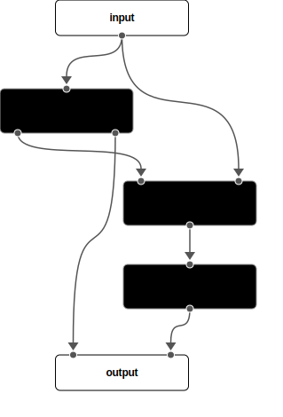
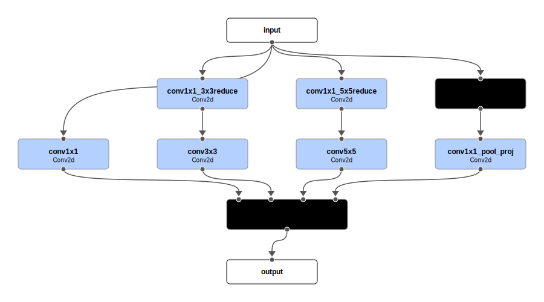
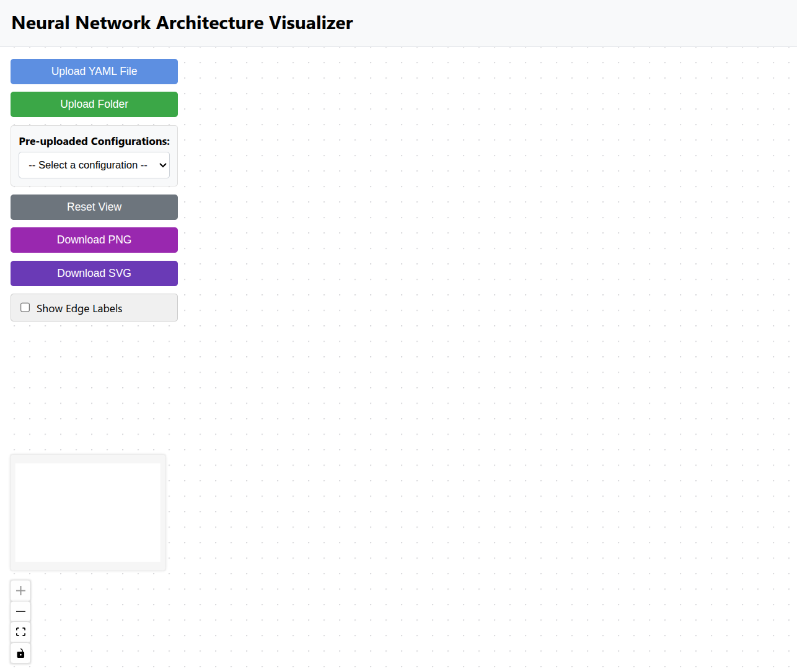
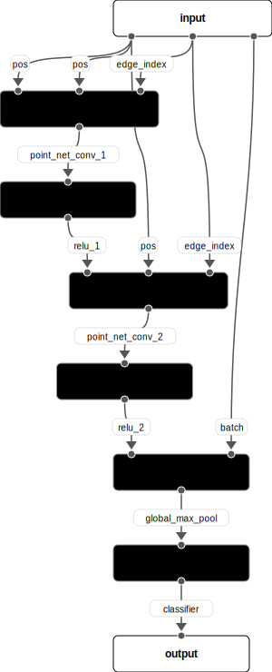
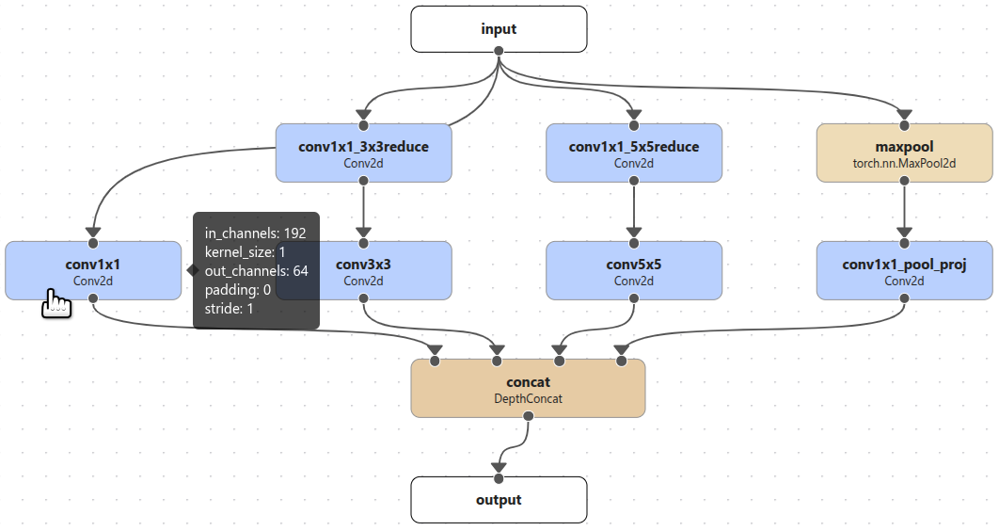

# Quick Start

This project aims to create a simple and intuitive format to:

1. describe the architecture of a neural network
2. be easily parsed by a Python script to build the model
3. be parsed by a visualization tool to create a diagram of the architecture.

To this end, a ***YAML*** format is defined to describe a so-called ***ComposableModel*** (***CM***), which can be uploaded to the [***Neural Network Architecture Visualizer***](https://network-visualizer-36300.web.app/) for visualization. The ***CM*** can be built using the `ComposableModel` class in the `model_composer` package ([repository](https://github.com/liuji1031/model_composer))

To use the visualization tool, you need to provide a valid YAML file (or a main YAML file with other referenced YAML files) that describes a ***CM***. The YAML file should conform to the format described in the next section. A toy example is provided below, whose rendered architecture is also shown. 

!!! example "Toy example"

    ```yaml
    name: toy_example
    modules:
        input:
          - x

        module_1:
          cls: module_type_1
          inp_src:
            - x
          config:
            param1: 42
            param2: "42"
          out_num: 2

        module_2:
          cls: module_type_2
          inp_src:
            - module_1.0
            - x
          config: module_2.yaml
  
        module_3:
          cls: module_type_3
          inp_src:
            - module_2

        output:
          - module_1.1
          - module_3
    ```

!!! example "Rendered architecture for the toy example"
    {width=100%}
    /// caption
    Architecture of the toy example neural network. 
    ///


## 1. YAML format
The YAML file for ***CM*** contains the following fields:

* ***name***: The name of the ***CM***. This is used to identify the model in the visualization tool and in the code that builds the model. <br/>
* ***modules***: A collection of modules that make up the model. Each module has a name, a set of parameters that define how to build it (except for the "input" and "output" module) and other fields that define the connections between the modules. The fields for each module include: <br/>
    + ***cls***: The class of the module. This is used to identify the type of module in that builds the model. Optional for visualization.
    + ***inp_src***: A list of input sources for the module. These represent the positional arguments of the module.
    * ***config***: A dictionary of configuration parameters for the module. This can be either a dictionary of parameters or a path to a YAML file that contains the parameters. 
    + ***out_num***: The number of outputs for the module. This is used to identify the output sources of the module. Default to 1 if not specified.

## 2. Define modules

### 2.1 Input module
* The list of variable names under the ***input*** module defines the positional arguments of the model. 
* The names of the variables can be arbitrary, but they should be consistent with the rest of the YAML file.
* The input module does not need any other fields, as its sole purpose is to define the positional arguments of the model.

    !!! example
        In the example above, the input module has a single positional argument called ***x***, which is in turn passed to the first module, ***module_1*** (see its ***inp_src*** section). 


### 2.2 Actual modules
* The module ***name*** is the key of the module in the ***modules*** section. 
* The ***cls*** field is the class of the module needed to build the model. It can be built-in class (e.g., `torch.nn.Conv2D`) or custom registered class. This field can be omitted if only the visualization is needed.

    !!! example
        In the example above, the ***cls*** field is set to ***module_type_1*** for ***module_1***, ***module_type_2*** for ***module_2***, and ***module_type_3*** for ***module_3***. The actual class names are important for building the model, but can be omitted for the visualization tool.

* The ***inp_src*** field is a list of input sources for the module, representing its positional arguments. The input sources can come from any of the variables specified in the input module or from the outputs of other modules.

    !!! note "How to specify module outputs"
        1. when the module has only one output, the output can be specified by its name only, e.g., ***module_1***.
        2. when the module has more than one output, the output is specified by its name and the output index, e.g., ***module_1.0***, where the index starts at 0 and goes up to ***out_num - 1***, where ***out_num*** is the number of outputs for the module. The ***out_num*** field can be omitted if the module has only one output, otherwise it needs to be explicitly set in the YAML file. 
        

    !!! Example
        In the example above, ***module_1*** has two outputs, which are specified as ***module_1.0*** and ***module_1.1***. In this case, the ***out_num*** field needs to be explicitly set to 2 (required) to indicate that the module has two outputs. All other modules have single outputs, so the outputs are specified by the module name only.

* The ***config*** field can be either a dictionary of parameters or a path to a YAML file that contains the parameters that are needed to build the module.

    !!! example
        In the example above, ***module_1*** has two parameters, ***param1*** and ***param2***. If a YAML file is provided as in ***module_2***, the parameters are read from the file and passed to the module constructor. The ***config*** field can also be omitted if building the module with default parameters is desired or the file is used only for visualization.


* ***CM*** can be nested, meaning that one or more of its modules can be defined as other ***CM***s, which allows the user to choose a specific hierarchical structure for best conveying the architecture of the model.
    * The ***config*** for the nested ***CM*** is recommended to be a path to a separate YAML file that follows the same format as the main YAML file. 
      * The visualization tool will automatically parse the nested ***CM***. The user can double-click the nested ***CM*** to expand the module and inspect its internal structure. This is useful for visualizing complex architectures that can benefit from hierarchical representations. See [**section 3.3**](#33-composablemodel) for more details on how to interact with the ***CM***s in the visualization tool.


### 2.3 Output module
* The output module is defined by a list of variable names that represent the outputs of the model.
* The variable names can come from any of the modules defined in the ***modules*** section, including the input module.
* The output module does not need any other fields, as its sole purpose is to define the outputs of the model.

    !!! example
        In the example above, the output module has two outputs, ***module_1.1*** (second output from ***module_1***) and ***module_3***. 

### 2.4 Real-world example
The example below shows how to define an real-world architecture, i.e., an inception block (3a) from the GoogLeNet, using the ***CM*** format. 

The parsing relies on the `OmegaConf` library, which allows for easy interpolation of the parameters. Note the additional ***hyper_params*** section, which is helpful for defining all other inception blocks by swapping out the values. The user can thus define any number of additional fields in the YAML file as they see fit to expand the expressivness of the YAML file. 

!!! example "YAML file for Inception block"

    ```yaml
    name: inception_3a
    hyper_params:
      in_channels: 192
      n_filter_conv1x1: 64
      n_filter_3x3reduce: 96
      n_filter_3x3: 128
      n_filter_5x5reduce: 16
      n_filter_5x5: 32
      n_filter_pool_proj: 32
    modules:
      input:
      - x
      conv1x1_3x3reduce:
        cls: Conv2d
        config:
          in_channels: ${hyper_params.in_channels}
          out_channels: ${hyper_params.n_filter_3x3reduce}
          kernel_size: 1
          stride: 1
          padding: 0
        inp_src:
        - x
      conv1x1_5x5reduce:
        cls: Conv2d
        config:
          in_channels: ${hyper_params.in_channels}
          out_channels: ${hyper_params.n_filter_5x5reduce}
          kernel_size: 1
          stride: 1
          padding: 0
        inp_src:
        - x
      maxpool:
        cls: torch.nn.MaxPool2d
        config:
          kernel_size: 3
          stride: 1
          padding: 1
        inp_src:
        - x
      conv1x1:
        cls: Conv2d
        config:
          in_channels: ${hyper_params.in_channels}
          out_channels: ${hyper_params.n_filter_conv1x1}
          kernel_size: 1
          stride: 1
          padding: 0
        inp_src:
        - x
      conv3x3:
        cls: Conv2d
        config:
          in_channels: ${modules.conv1x1_3x3reduce.config.out_channels}
          out_channels: ${hyper_params.n_filter_3x3}
          kernel_size: 3
          stride: 1
          padding: 1
        inp_src:
        - conv1x1_3x3reduce
      conv5x5:
        cls: Conv2d
        config:
          in_channels: ${modules.conv1x1_5x5reduce.config.out_channels}
          out_channels: ${hyper_params.n_filter_5x5}
          kernel_size: 5
          stride: 1
          padding: 2
        inp_src:
        - conv1x1_5x5reduce
      conv1x1_pool_proj:
        cls: Conv2d
        config:
          in_channels: ${hyper_params.in_channels}
          out_channels: ${hyper_params.n_filter_pool_proj}
          kernel_size: 1
          stride: 1
          padding: 0
        inp_src:
        - maxpool
      concat:
        cls: DepthConcat
        config:
          dim: 1
        inp_src:
        - conv1x1
        - conv3x3
        - conv5x5
        - conv1x1_pool_proj
      output:
        - concat
    ```
!!! example "Rendered architecture"
    {width=100%}
    /// caption
    Architecture of the Inception block from the GoogLeNet. 
    ///

## 3. Visualization tool

### 3.1 User Interface
{width=100%}
The user interface of the visualization tool is designed to be intuitive and easy to use. The frontend is implemented using ReactFlow.

### 3.2 Functionality
* ***Pre-uploaded Configurations***: The user can select from a list of pre-uploaded neural network architectures to play with the visualization tool. The current list includes:
    + *GoogLeNet*
    + *PointNetConv*
    + *ToyExample* from the previous section
* ***Upload YAML File***: The user can upload a single YAML file that conforms to the format described above. The file is parsed and the architecture is rendered in the visualization tool. 
* ***Upload Folder***: The user can upload a folder that contains multiple YAML files. This useful when the main YAML file references other YAML files in the config field of one or more modules. The user will be asked to select the main YAML file, and the tool will automatically parse the other YAML files in the folder. The YAML files referenced need to be specified using relative paths.

    !!! example "Example folder structure for GoogLeNet"

        One example folder structure is shown below, which is generated for GoogLeNet. Here `model.yaml` is the main YAML file, while the other YAML files referenced by the inception blocks and auxiliary classifiers are under `config` sub-directory. The main `model.yaml` file is also attached below. See all other YAML files [**here**](https://github.com/liuji1031/model_composer/tree/master/example/yaml/GoogLeNet). <br/>
        > GoogLeNet <br/>
        ├── model.yaml <br/>
        └── config/<br/>
        &nbsp;&nbsp;&nbsp;&nbsp;&nbsp;&nbsp;&nbsp;&nbsp;├── inception_3a.yaml<br/>
        &nbsp;&nbsp;&nbsp;&nbsp;&nbsp;&nbsp;&nbsp;&nbsp;├── inception_3b.yaml<br/>
        &nbsp;&nbsp;&nbsp;&nbsp;&nbsp;&nbsp;&nbsp;&nbsp;├── inception_4a.yaml<br/>
        &nbsp;&nbsp;&nbsp;&nbsp;&nbsp;&nbsp;&nbsp;&nbsp;├── inception_4b.yaml<br/>
        &nbsp;&nbsp;&nbsp;&nbsp;&nbsp;&nbsp;&nbsp;&nbsp;├── inception_4c.yaml<br/>
        &nbsp;&nbsp;&nbsp;&nbsp;&nbsp;&nbsp;&nbsp;&nbsp;├── inception_4d.yaml<br/>
        &nbsp;&nbsp;&nbsp;&nbsp;&nbsp;&nbsp;&nbsp;&nbsp;├── inception_4e.yaml<br/>
        &nbsp;&nbsp;&nbsp;&nbsp;&nbsp;&nbsp;&nbsp;&nbsp;├── inception_5a.yaml<br/>
        &nbsp;&nbsp;&nbsp;&nbsp;&nbsp;&nbsp;&nbsp;&nbsp;├── inception_5b.yaml<br/>
        &nbsp;&nbsp;&nbsp;&nbsp;&nbsp;&nbsp;&nbsp;&nbsp;├── auxiliary_classifier_4a.yaml<br/>
        &nbsp;&nbsp;&nbsp;&nbsp;&nbsp;&nbsp;&nbsp;&nbsp;└── auxiliary_classifier_4b.yaml<br/>

    ??? example "model.yaml of GoogLeNet"

        ```yaml
        name: GoogLeNet
        modules:
          input:
            - x
          convolution_1:
            cls: Conv2d
            config:
              in_channels: 3
              out_channels: 64
              kernel_size: 7
              stride: 2
              padding: 3
            inp_src:
              - x
          maxpool_1:
            cls: torch.nn.MaxPool2d
            config:
              kernel_size: 3
              stride: 2
              padding: 1
            inp_src:
              - convolution_1
          convolution_2_reduce:
            cls: Conv2d
            config:
              in_channels: 64
              out_channels: 64
              kernel_size: 1
              stride: 1
              padding: 0
            inp_src:
              - maxpool_1
          convolution_2:
            cls: Conv2d
            config:
              in_channels: 64
              out_channels: 192
              kernel_size: 3
              stride: 1
              padding: 1
            inp_src:
              - convolution_2_reduce
          maxpool_2:
            cls: torch.nn.MaxPool2d
            config:
              kernel_size: 3
              stride: 2
              padding: 1
            inp_src:
              - convolution_2
          inception_3a:
            cls: ComposableModel
            config: config/inception_3a.yaml
            inp_src:
              - maxpool_2
          inception_3b:
            cls: ComposableModel
            config: config/inception_3b.yaml
            inp_src:
              - inception_3a
          maxpool_3:
            cls: torch.nn.MaxPool2d
            config:
              kernel_size: 3
              stride: 2
              padding: 1
            inp_src:
              - inception_3b
          inception_4a:
            cls: ComposableModel
            config: config/inception_4a.yaml
            inp_src:
              - maxpool_3
          inception_4b:
            cls: ComposableModel
            config: config/inception_4b.yaml
            inp_src:
              - inception_4a
          inception_4c:
            cls: ComposableModel
            config: config/inception_4c.yaml
            inp_src:
              - inception_4b
          inception_4d:
            cls: ComposableModel
            config: config/inception_4d.yaml
            inp_src:
              - inception_4c
          inception_4e:
            cls: ComposableModel
            config: config/inception_4e.yaml
            inp_src:
              - inception_4d
          maxpool_4:
            cls: torch.nn.MaxPool2d
            config:
              kernel_size: 3
              stride: 2
              padding: 1
            inp_src:
              - inception_4e
          inception_5a:
            cls: ComposableModel
            config: config/inception_5a.yaml
            inp_src:
              - maxpool_4
          inception_5b:
            cls: ComposableModel
            config: config/inception_5b.yaml
            inp_src:
              - inception_5a
          avgpool:
            cls: torch.nn.AdaptiveAvgPool2d
            config:
              output_size: 1
            inp_src:
              - inception_5b
          dropout:
            cls: torch.nn.Dropout
            config:
              p: 0.4
            inp_src:
              - avgpool
          flatten:
            cls: torch.nn.Flatten
            config:
              start_dim: 1
              end_dim: -1
            inp_src:
              - dropout
          linear:
            cls: torch.nn.Linear
            config:
              in_features: 1024
              out_features: 1000
            inp_src:
              - flatten
          softmax:
            cls: torch.nn.Softmax
            config:
              dim: 1
            inp_src:
              - linear
          auxiliary_classifier_4a:
            cls: ComposableModel
            config: config/auxiliary_classifier_4a.yaml
            inp_src:
              - inception_4a
          auxiliary_classifier_4b:
            cls: ComposableModel
            config: config/auxiliary_classifier_4b.yaml
            inp_src:
              - inception_4d
          output:
            - auxiliary_classifier_4a
            - auxiliary_classifier_4b
            - softmax
        ```
        
* ***Download PNG*** and ***Download SVG***: The user can download the rendered architecture as a PNG or SVG file. The SVG file is recommended for high-quality images, which can also be edited using Inkscape, Adobe Illustrator, or any other SVG editor.
* ***Show Edge Labels***: The user can toggle the edge labels on and off. The edge labels show the names of output going into the next node, which can be useful when the architecture is complex. Default is off.

    !!! example "Show edge labels"

        Showing edge labels can be useful for complex input structures. For example, in Graph Neural Networks (GNNs), the input can consist of the point positions (`pos`) and the edge indices (`edge_index`) of the graph, as well as the batch indices (`batch`). These inputs are passed to different modules in the GNN. An example is shown below, where the edge labels are shown. The YAML file for this graph is also attached below. This example is based on this [**notebook**](https://colab.research.google.com/drive/1D45E5bUK3gQ40YpZo65ozs7hg5l-eo_U?usp=sharing) from PyTorch Geometric tutorials.
        
        {width=100%}
        /// caption
        Graph Neural Network (GNN) example with edge labels.
        ///
  
    ??? example "YAML file for the GNN example"

        ```yaml
        name: point_net_conv
        modules:
          input:
            - pos
            - edge_index
            - batch
    
          point_net_conv_1:
            inp_src:
              - pos
              - pos
              - edge_index
    
          relu_1:
            inp_src:
              - point_net_conv_1
    
          point_net_conv_2:
            inp_src:
              - relu_1
              - pos
              - edge_index

          relu_2:
            inp_src:
              - point_net_conv_2

          global_max_pool:
            inp_src:
              - relu_2
              - batch

          classifier:
            inp_src:
              - global_max_pool
    
          output:
            - classifier
        ```

      
* ***Display of Module Configurations***: The user can hover the mouse over the module to see the configuration parameters of the module if specified.

    !!! example "Show module configuration"

        {width=90%}
        /// caption
        Hovering over the module shows the configuration parameters of the module. 
        ///

### 3.3 ComposableModel
The ***ComposableModel*** (***CM***) is a special type of module that allows the user to interact with it. Specifically, when the user double-clicks the ***CM***, the view expands into the module to show its internal structure. 

Expanding into nested ***CM***s allows the user to inspect the details of the block without cluttering the main architecture. The visualization tool keeps track of the level of the expanded ***CM***. The ***Go Back*** button appears in the expanded view that allows the user to go back to the upper level architecture. The ***CM***s can be nested to any level, so the user can choose the level of granularity that best suits their needs.

The video below shows an example of interacting with the ***CM***s (inception blocks) in the GoogLeNet.
!!! example "Interacting with ComposableModel"

    

## 4. Building the model
Currently, PyTorch is the only supported framework for building the model. See also the [**repository**](https://github.com/liuji1031/model_composer) for more details on how to build the model from the YAML file.

Here we will use the GoogLeNet example shown above to illustrate how to build the model. The YAML file is attached below, along with the rendered architecture.
??? example "model.yaml of GoogLeNet"

    ```yaml
    name: GoogLeNet
    modules:
      input:
        - x
      convolution_1:
        cls: Conv2d
        config:
          in_channels: 3
          out_channels: 64
          kernel_size: 7
          stride: 2
          padding: 3
        inp_src:
          - x
      maxpool_1:
        cls: torch.nn.MaxPool2d
        config:
          kernel_size: 3
          stride: 2
          padding: 1
        inp_src:
          - convolution_1
      convolution_2_reduce:
        cls: Conv2d
        config:
          in_channels: 64
          out_channels: 64
          kernel_size: 1
          stride: 1
          padding: 0
        inp_src:
          - maxpool_1
      convolution_2:
        cls: Conv2d
        config:
          in_channels: 64
          out_channels: 192
          kernel_size: 3
          stride: 1
          padding: 1
        inp_src:
          - convolution_2_reduce
      maxpool_2:
        cls: torch.nn.MaxPool2d
        config:
          kernel_size: 3
          stride: 2
          padding: 1
        inp_src:
          - convolution_2
      inception_3a:
        cls: ComposableModel
        config: config/inception_3a.yaml
        inp_src:
          - maxpool_2
      inception_3b:
        cls: ComposableModel
        config: config/inception_3b.yaml
        inp_src:
          - inception_3a
      maxpool_3:
        cls: torch.nn.MaxPool2d
        config:
          kernel_size: 3
          stride: 2
          padding: 1
        inp_src:
          - inception_3b
      inception_4a:
        cls: ComposableModel
        config: config/inception_4a.yaml
        inp_src:
          - maxpool_3
      inception_4b:
        cls: ComposableModel
        config: config/inception_4b.yaml
        inp_src:
          - inception_4a
      inception_4c:
        cls: ComposableModel
        config: config/inception_4c.yaml
        inp_src:
          - inception_4b
      inception_4d:
        cls: ComposableModel
        config: config/inception_4d.yaml
        inp_src:
          - inception_4c
      inception_4e:
        cls: ComposableModel
        config: config/inception_4e.yaml
        inp_src:
          - inception_4d
      maxpool_4:
        cls: torch.nn.MaxPool2d
        config:
          kernel_size: 3
          stride: 2
          padding: 1
        inp_src:
          - inception_4e
      inception_5a:
        cls: ComposableModel
        config: config/inception_5a.yaml
        inp_src:
          - maxpool_4
      inception_5b:
        cls: ComposableModel
        config: config/inception_5b.yaml
        inp_src:
          - inception_5a
      avgpool:
        cls: torch.nn.AdaptiveAvgPool2d
        config:
          output_size: 1
        inp_src:
          - inception_5b
      dropout:
        cls: torch.nn.Dropout
        config:
          p: 0.4
        inp_src:
          - avgpool
      flatten:
        cls: torch.nn.Flatten
        config:
          start_dim: 1
          end_dim: -1
        inp_src:
          - dropout
      linear:
        cls: torch.nn.Linear
        config:
          in_features: 1024
          out_features: 1000
        inp_src:
          - flatten
      softmax:
        cls: torch.nn.Softmax
        config:
          dim: 1
        inp_src:
          - linear
      auxiliary_classifier_4a:
        cls: ComposableModel
        config: config/auxiliary_classifier_4a.yaml
        inp_src:
          - inception_4a
      auxiliary_classifier_4b:
        cls: ComposableModel
        config: config/auxiliary_classifier_4b.yaml
        inp_src:
          - inception_4d
      output:
        - auxiliary_classifier_4a
        - auxiliary_classifier_4b
        - softmax
    ```
!!! example "Rendered architecture of GoogLeNet"
    {width=100%}
    /// caption
    Architecture of the GoogLeNet. 
    ///

### 4.1 Registering modules
* Currently all `torch.nn` modules are supported. These modules are automatically registered with the `ModuleRegistry` class, and can be directly used in the ***cls*** field in YAML file, e.g., `torch.nn.Conv2d`, `torch.nn.Linear`, etc.
* The user can define their own modules through registering with the `ModuleReisgtry` class.

    !!! example "Registering a custom module"

        In the GoogLeNet example above, the ***DepthConcat*** module is a custom module that concatenates the inputs along the specified dimension. The ***Conv2d*** module is a simple wrapper around `torch.nn.Conv2d` that adds batch normalization and ReLU activation. All other modules are native `torch.nn` modules. The code for defining and registering the custom modules is shown below.
        ```python
        import torch
        from model_composer import ModuleRegistry


        @ModuleRegistry.register("DepthConcat")
        class DepthConcat(torch.nn.Module):
            """Concatenate the inputs along the specified dimension."""

            def __init__(self, dim=1):
                super().__init__()
                self.dim = dim

            def forward(self, *inputs):
                return torch.cat(inputs, dim=self.dim)


        @ModuleRegistry.register("Conv2d")
        class Conv2d(torch.nn.Module):
            """A simple wrapper around torch.nn.Conv2d."""

            def __init__(self, in_channels, out_channels, kernel_size, stride, padding):
                super().__init__()
                self.conv2d = torch.nn.Conv2d(
                    in_channels, out_channels, kernel_size, stride, padding
                )
                self.bn = torch.nn.BatchNorm2d(out_channels)
                self.relu = torch.nn.ReLU()

            def forward(self, x):
                return self.relu(self.bn(self.conv2d(x)))
        ```

* The user can choose to define custom modules at any level of granularity they see fit and compose them together to form a final ***ComposableModel***. The GoogLeNet example above only used nested ***CM***s to define the inception blocks and auxiliary classifiers, but the user is free to group other modules together to form a ***CM***.

### 4.2 Building the model
The model can be built by supplying the YAML config file to the ***ComposableModel*** class. The class will automatically parse the YAML file and build the model. It automatically determines the correct sequence to call the modules specified in the YAML file with the correct input sources. The code example for building the GoogLeNet model is shown below.

!!! example "Building the GoogLeNet model"

    ```python
    from model_composer import read_config, ComposableModel

    cfg = read_config("example/GoogLeNet/model.yaml")
    model = ComposableModel(**cfg)
    ```


Verifying the model output shape is as expected (all three outputs should be of shape `[batch, 1000]` for the GoogLeNet model):

!!! example "Verifying the model output shape"

    ```python
    from loguru import logger
    import torch

    input = torch.randn(1, 3, 224, 224)
    output = model(input, print_output_shape=True)
    for k, out in enumerate(output):
        logger.info(f"Output {k} shape: {out.shape}")
    ```

    ```bash
    2025-05-08 12:33:28.522 | INFO     | model_composer.composer:forward:228 - Module convolution_1 output shape: [torch.Size([1, 64, 112, 112])]
    2025-05-08 12:33:28.529 | INFO     | model_composer.composer:forward:228 - Module maxpool_1 output shape: [torch.Size([1, 64, 56, 56])]
    2025-05-08 12:33:28.533 | INFO     | model_composer.composer:forward:228 - Module convolution_2_reduce output shape: [torch.Size([1, 64, 56, 56])]
    2025-05-08 12:33:28.540 | INFO     | model_composer.composer:forward:228 - Module convolution_2 output shape: [torch.Size([1, 192, 56, 56])]
    2025-05-08 12:33:28.545 | INFO     | model_composer.composer:forward:228 - Module maxpool_2 output shape: [torch.Size([1, 192, 28, 28])]
    2025-05-08 12:33:28.556 | INFO     | model_composer.composer:forward:228 - Module inception_3a output shape: [torch.Size([1, 256, 28, 28])]
    2025-05-08 12:33:28.572 | INFO     | model_composer.composer:forward:228 - Module inception_3b output shape: [torch.Size([1, 480, 28, 28])]
    2025-05-08 12:33:28.576 | INFO     | model_composer.composer:forward:228 - Module maxpool_3 output shape: [torch.Size([1, 480, 14, 14])]
    2025-05-08 12:33:28.586 | INFO     | model_composer.composer:forward:228 - Module inception_4a output shape: [torch.Size([1, 512, 14, 14])]
    2025-05-08 12:33:28.596 | INFO     | model_composer.composer:forward:228 - Module inception_4b output shape: [torch.Size([1, 512, 14, 14])]
    2025-05-08 12:33:28.600 | INFO     | model_composer.composer:forward:228 - Module auxiliary_classifier_4a output shape: [torch.Size([1, 1000])]
    2025-05-08 12:33:28.609 | INFO     | model_composer.composer:forward:228 - Module inception_4c output shape: [torch.Size([1, 512, 14, 14])]
    2025-05-08 12:33:28.619 | INFO     | model_composer.composer:forward:228 - Module inception_4d output shape: [torch.Size([1, 528, 14, 14])]
    2025-05-08 12:33:28.630 | INFO     | model_composer.composer:forward:228 - Module inception_4e output shape: [torch.Size([1, 832, 14, 14])]
    2025-05-08 12:33:28.634 | INFO     | model_composer.composer:forward:228 - Module auxiliary_classifier_4b output shape: [torch.Size([1, 1000])]
    2025-05-08 12:33:28.636 | INFO     | model_composer.composer:forward:228 - Module maxpool_4 output shape: [torch.Size([1, 832, 7, 7])]
    2025-05-08 12:33:28.643 | INFO     | model_composer.composer:forward:228 - Module inception_5a output shape: [torch.Size([1, 832, 7, 7])]
    2025-05-08 12:33:28.651 | INFO     | model_composer.composer:forward:228 - Module inception_5b output shape: [torch.Size([1, 1024, 7, 7])]
    2025-05-08 12:33:28.653 | INFO     | model_composer.composer:forward:228 - Module avgpool output shape: [torch.Size([1, 1024, 1, 1])]
    2025-05-08 12:33:28.654 | INFO     | model_composer.composer:forward:228 - Module dropout output shape: [torch.Size([1, 1024, 1, 1])]
    2025-05-08 12:33:28.656 | INFO     | model_composer.composer:forward:228 - Module flatten output shape: [torch.Size([1, 1024])]
    2025-05-08 12:33:28.658 | INFO     | model_composer.composer:forward:228 - Module linear output shape: [torch.Size([1, 1000])]
    2025-05-08 12:33:28.659 | INFO     | model_composer.composer:forward:228 - Module softmax output shape: [torch.Size([1, 1000])]
    2025-05-08 12:33:28.665 | INFO     | __main__:<module>:7 - Output 0 shape: torch.Size([1, 1000])
    2025-05-08 12:33:28.666 | INFO     | __main__:<module>:7 - Output 1 shape: torch.Size([1, 1000])
    2025-05-08 12:33:28.667 | INFO     | __main__:<module>:7 - Output 2 shape: torch.Size([1, 1000])
    ```

## 5. Summary

In this tutorial, we introduced the ***ComposableModel*** (***CM***) format for defining neural network architectures in a YAML file. The format is designed to be flexible and extensible, allowing the user to define complex architectures with ease. The visualization tool provides an intuitive interface for exploring the architecture and inspecting the details of the model. The model can be built using PyTorch, and custom modules can be registered for use in the YAML file.

Next, we will dive a bit deeper into [**why I think using the format might actually be useful**](rationale.md).